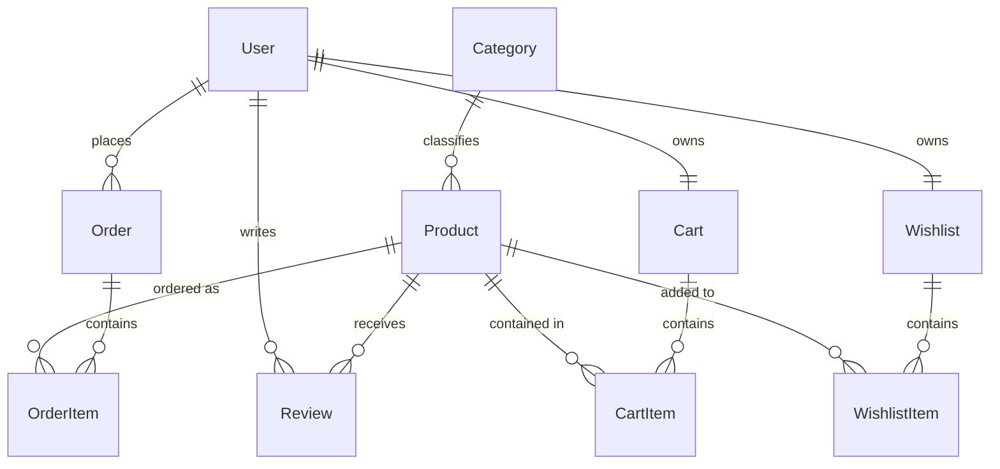

# MERN eCommerce Application - Module 1: Project Initialization

Welcome to the production-quality MERN Stack E-Commerce Application. This repository is built module-by-module to demonstrate robust software engineering practices, MVC architecture, clean coding standards, and industry-standard security.

---

## 1. Project Folder Structure

The project is structured to keep the frontend and backend decoupled, facilitating independent scalability and clean deployment.

```
ecommerce-app/
├── backend/
│   ├── config/
│   │   └── db.js            # MongoDB Atlas connection setup
│   ├── node_modules/        # Server dependencies (ignored by Git)
│   ├── .env                 # Server secrets (ignored by Git)
│   ├── .env.example         # Template for backend environment variables
│   ├── .gitignore           # Excludes node_modules and .env from backend commits
│   ├── package-lock.json
│   ├── package.json         # Node scripts & dependencies
│   └── server.js            # Express server configuration and entrypoint
├── docs/
│   └── atlas_guide.md       # Step-by-step MongoDB Atlas setup guide
├── frontend/
│   ├── public/              # Static files
│   ├── src/
│   │   ├── assets/          # Image and font resources
│   │   ├── services/
│   │   │   └── api.js       # Axios configuration with interceptors
│   │   ├── store/
│   │   │   └── store.js     # Redux Toolkit store setup
│   │   ├── App.css          # App stylesheet
│   │   ├── App.jsx          # Root component & Routing configuration
│   │   ├── index.css        # Tailwind CSS import & global custom themes
│   │   └── main.jsx         # React DOM mount point & Provider wrappers
│   ├── .env                 # Client API url (ignored by Git)
│   ├── .env.example         # Template for client environment variables
│   ├── .gitignore           # Excludes build and client env files
│   ├── eslint.config.js     # ESLint configuration rules
│   ├── index.html           # Main template
│   ├── package-lock.json
│   ├── package.json         # Client dependencies & scripts
│   ├── tailwind.config.js   # Tailwind v4 configuration file
│   └── vite.config.js       # Vite bundler configuration with @tailwindcss/vite
├── .gitignore               # Root gitignore excluding dependencies and builds
└── README.md                # Project documentation & Module 1 guide
```

---

## 2. Complete File Explanation

### Backend
* **[backend/server.js](file:///E:/ecommerce-app/backend/server.js)**: Configures the Express app with middleware like Helmet (security headers), Morgan (HTTP logging), CORS, and parses URL-encoded/JSON payloads. Defines a health check endpoint and error-handling middleware.
* **[backend/config/db.js](file:///E:/ecommerce-app/backend/config/db.js)**: Uses Mongoose to connect to the MongoDB Atlas cluster specified by `MONGO_URI`. Features error catching with detailed IP Whitelisting troubleshooting instructions.
* **[backend/.env.example](file:///E:/ecommerce-app/backend/.env.example)**: Provides a layout of backend secrets to keep API keys, ports, and database credentials out of version control.

### Frontend
* **[frontend/vite.config.js](file:///E:/ecommerce-app/frontend/vite.config.js)**: Integrates React with Vite and bundles stylesheets utilizing the `@tailwindcss/vite` compiler.
* **[frontend/src/index.css](file:///E:/ecommerce-app/frontend/src/index.css)**: Implements the Tailwind CSS v4 design system, defines color extensions (`primary`, `secondary`, `danger`) in the `@theme` rule, and houses clean button and card component utility classes.
* **[frontend/src/services/api.js](file:///E:/ecommerce-app/frontend/src/services/api.js)**: Exports an Axios client targeting `VITE_API_URL` equipped with interceptors to automatically forward authentication tokens and handle `401 Unauthorized` responses.
* **[frontend/src/store/store.js](file:///E:/ecommerce-app/frontend/src/store/store.js)**: Bootstraps the Redux Toolkit store for modular state management.
* **[frontend/src/App.jsx](file:///E:/ecommerce-app/frontend/src/App.jsx)**: Defines page routing (React Router) and the starter Landing page.

---

## 3. API Endpoints

| Method | Endpoint | Description | Access | Response |
| :--- | :--- | :--- | :--- | :--- |
| **GET** | `/api/health` | Server Health Check | Public | `{ success: true, message: "Server is running", ... }` |

---

## 4. MongoDB Atlas Connection

The application connects to **MongoDB Atlas** using **Mongoose**. Refer to [docs/atlas_guide.md](file:///E:/ecommerce-app/docs/atlas_guide.md) for step-by-step guidance on setting up a cluster, database user, whitelisting your IP, and obtaining the credentials connection string.

---

## 5. Running & Testing Module 1

### Prerequisites
Make sure you have [Node.js](https://nodejs.org/) installed.

### Steps to Run
1. **Initialize Backend Environment**:
   - Create a file named `.env` in the `backend/` directory.
   - Fill it using the template in `backend/.env.example`.
2. **Start Backend Server**:
   ```bash
   cd backend
   npm run dev
   ```
   *Verify the output console shows:* `✅ Server running on port 5000` and `✅ MongoDB Atlas connected`.
3. **Initialize Frontend Environment**:
   - Create a file named `.env` in the `frontend/` directory.
   - Fill it using the template in `frontend/.env.example`.
4. **Start Frontend Server**:
   ```bash
   cd frontend
   npm run dev
   ```
   *Open browser to:* [http://localhost:5174/](http://localhost:5174/) (or the port outputted in terminal).

### Testing Steps
- **Backend API**: Send a request to `http://localhost:5000/api/health` using Postman, Thunder Client, or your browser. Verify you receive the JSON health status payload.
- **Frontend Build**: Test compilation of the Tailwind v4 assets by executing `npm run build` in the `frontend` folder.

---

## 6. Interview Questions (Module 1 Concepts)

### Q1: What is the purpose of CORS middleware and why is it necessary?
**Answer**: Cross-Origin Resource Sharing (CORS) is a security mechanism enforced by web browsers. It restricts web pages from making requests to a domain different from the one that served the page. CORS middleware in Express configures headers (`Access-Control-Allow-Origin`, `Access-Control-Allow-Credentials`) to allow our React app (running on port 5173/5174) to securely query the Node backend (running on port 5000).

### Q2: Why do we use `.env` files and why must they be gitignored?
**Answer**: `.env` files store configuration values and sensitive credentials (such as DB passwords, private API keys, JWT tokens) outside the source code. Keeping them separate prevents hardcoding credentials, making environment swaps (dev vs staging vs prod) easy. They are listed in `.gitignore` to prevent leaking private credentials to public version control repositories like GitHub.

### Q3: What is the difference between `dotenv` and `nodemon`?
**Answer**: `dotenv` is a zero-dependency module that loads environment variables from a `.env` file into Node's `process.env`. `nodemon` is a utility tool that monitors for any changes in source code and automatically restarts the Node server, saving development time.

### Q4: Why is it important to use Helmet middleware in an Express application?
**Answer**: Helmet is a collection of middleware functions that set HTTP response headers (like `Content-Security-Policy`, `X-Content-Type-Options`, `Strict-Transport-Security`, etc.) to secure the Express app against common web vulnerabilities (e.g., cross-site scripting (XSS), clickjacking, sniffing attacks).

---

# Module 2: Database Design

This module establishes our MongoDB data structure. We use Mongoose to define schemas, indexes, and relationships for the eCommerce domain.

## 1. Entity-Relationship (ER) Diagram



---

## 2. Schema and Relationship Explanations

### 1. User Model (`backend/models/User.js`)
- **Type**: Parent entity.
- **Relationships**:
  - One-to-Many with `Order` and `Review`.
  - One-to-One with `Cart` and `Wishlist` (referenced by `user` ObjectId).
- **Features**: Includes standard validations, lowercase email constraints, and a pre-save mongoose hook to hash user passwords using `bcryptjs`. Exposes a prototype method `comparePassword()` for credential validation.

### 2. Category Model (`backend/models/Category.js`)
- **Type**: Parent entity.
- **Relationships**: One-to-Many with `Product`.
- **Features**: Enforces unique constraints on both category `name` and url-friendly `slug`.

### 3. Product Model (`backend/models/Product.js`)
- **Type**: Child entity of `Category`.
- **Relationships**:
  - Belongs to a single `Category` via `category` ObjectId reference.
  - One-to-Many with `Review`.
- **Features**: Enforces pricing bounds (`min: 0`), stock tracking bounds (`quantity`), and ratings averaging metrics.

### 4. Review Model (`backend/models/Review.js`)
- **Type**: Junction-style entity.
- **Relationships**: References both a single `User` and a single `Product`.
- **Features**: Utilizes a compound unique index `{ product: 1, user: 1 }` to enforce that a customer can submit **only one review per product**.

### 5. Cart Model (`backend/models/Cart.js`)
- **Type**: Direct child of `User`.
- **Relationships**: One-to-One with `User` and One-to-Many with `Product` (via the embedded `items` array).
- **Features**: Tracks selection quantities for rapid updates.

### 6. Wishlist Model (`backend/models/Wishlist.js`)
- **Type**: Direct child of `User`.
- **Relationships**: One-to-One with `User` and Many-to-Many with `Product` (referencing an array of Product ObjectIds).

### 7. Order Model (`backend/models/Order.js`)
- **Type**: Complex transaction record.
- **Relationships**: Belongs to a `User` and captures product snapshots (nested `orderItems` schema containing name, quantity, price, and referenced product).
- **Features**: Integrates comprehensive financial audit fields (`itemsPrice`, `taxPrice`, `shippingPrice`, `totalPrice`), shipping address maps, delivery/payment status flags, and order status transitions (`Pending` -> `Delivered`).

---

## 3. Testing Steps for Module 2
To verify that all Mongoose schemas load and compile without issues, you can execute the local schema validation test script:
1. Navigate to the `backend/` folder:
   ```bash
   cd backend
   ```
2. Run the temporary verification utility:
   ```bash
   node scratch_test_models.js
   ```
3. Ensure the output shows confirmation checkboxes for all 7 entities and prints: `⭐ ALL MONGOOSE MODELS HAVE COMPILED & VALIDATED SUCCESSFULLY! ⭐`

---

## 4. Interview Questions (Module 2 Concepts)

### Q1: What is the difference between referencing (normalization) and embedding (denormalization) in MongoDB?
**Answer**: 
- **Embedding (Denormalization)** involves nesting documents inside a parent document (like `items` inside the `Cart` schema). It is best for 1-to-1 or bounded 1-to-many relationships where data is read together and does not grow indefinitely (maximum document size in MongoDB is 16MB).
- **Referencing (Normalization)** stores references (ObjectIds) to separate documents (like `category` inside `Product`). It is ideal for unbound 1-to-many or many-to-many relationships, where referenced entities change independently and are queried in isolation.

### Q2: Why did we define a compound index on the Review schema?
**Answer**: We configured the compound index `reviewSchema.index({ product: 1, user: 1 }, { unique: true })`. This forces MongoDB to validate that the combination of `product` and `user` is unique, preventing a user from posting multiple reviews/ratings on the same item, ensuring integrity in the product review section.

### Q3: What is the select: false flag in the User password field?
**Answer**: Setting `select: false` on the password field instructs Mongoose to exclude the password hash field from query results by default (e.g. `User.find()` or `User.findOne()`). This prevents developers from accidentally exposing password hashes in API responses, improving security. If the password is explicitly needed (like during login), it can be retrieved using `.select('+password')`.

### Q4: How does pre-save middleware work in Mongoose?
**Answer**: Pre-save middleware (e.g., `userSchema.pre('save', ... )`) is a hook that executes asynchronous operations immediately before Mongoose writes the document to MongoDB. In our User model, we use it to check if the `password` field was modified (`this.isModified('password')`), automatically generating a salt and hashing the password with `bcryptjs` before storage.

